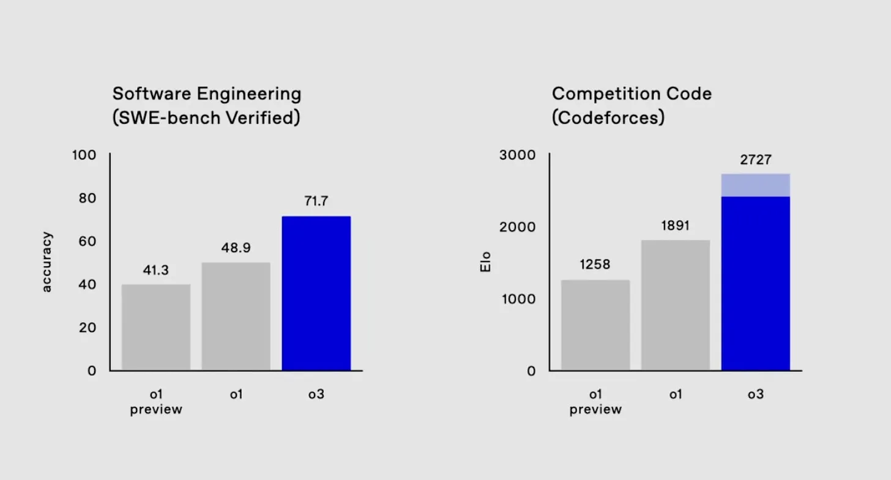
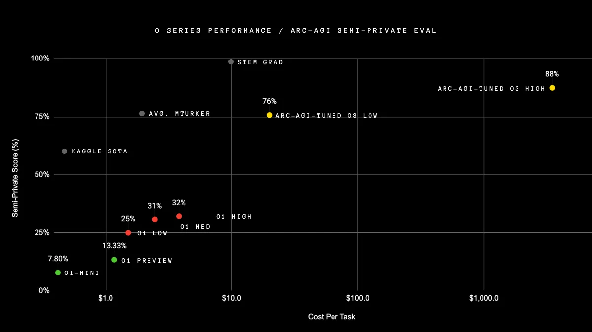

# The Autonomous Coding
## From Copilots to Self-Driving Software

<div class="pt-12">
  <span @click="$slidev.nav.next" class="px-2 py-1 rounded cursor-pointer" hover="bg-white bg-opacity-10">
    Press Space for next page <carbon:arrow-right class="inline"/>
  </span>
</div>

---
layout: two-cols
heading: Agenda
---

<v-clicks>

- What's the current state of AI in software engineering?
- LLM Limitations
- Prompt Engineering
- Live Demo

</v-clicks>

::right::

<div class="ml-4">
  
</div>

---
layout: section
heading: The Evolution of Software Engineering
---

<div class="grid grid-cols-2 gap-4">

<div>
<Tweet id="1767598414945292695" scale="0.8" />
</div>

<div>

## AI-Assisted Coding

- **Level 1: Line Keeping** (2022)
  - Code autocomplete with GitHub Copilot
  - Basic assistance like lane departure warnings
- **Level 2: Basic Automation** (2023)
  - ChatGPT code generation
  - Like cruise control and distance management
- **Level 3: Conditional Autonomy** (2024+)
  - Multi-file edits with Cursor
  - Complex maneuvers with human oversight
- **Level 4: High Autonomy** (Coming)
  - System-wide modifications
  - Full project navigation with safety review

</div>
</div>

---
layout: center
image: assets/waymo.jpg
heading: "Cursor: Beyond Simple Copilots"
---

<div class="flex justify-center">
  
</div>

---
layout: section
heading: "LLM Limitations & Reality Check"
---

<div class="grid grid-cols-2 gap-8">

<div class="mt-4">

## Current Limitations

- Random error distribution
- Inconsistent performance
- Need for human oversight

<div class="text-sm opacity-80 italic border-l-4 border-gray-400 pl-4 mt-8">
"… Now the farmer can safely leave the wolf with the goat because the cabbage is no longer a threat. …"
<div class="text-xs mt-1">
  <a href="https://arxiv.org/html/2405.19616v1" target="_blank" class="text-blue-500">
    Source: Easy Problems That LLMs Get Wrong (2024)
  </a>
</div>
</div>

</div>

<div class="flex flex-col gap-4 justify-start">
  
</div>

</div>

---
layout: section
heading: "Future Outlook (2025)"
---

<div class="grid grid-cols-2 gap-8">

<div class="mt-4">

## Future Outlook (2025+)

- Models won't be the limitation
- Focus shifts to usage patterns
- Enhanced SWE benchmarks
- Improved Codeforces performance

<div class="text-sm opacity-80 italic border-l-4 border-gray-400 pl-4 mt-8">
  "AI has written every line of code that I have worked on in the last two months, and I have heard the same from many people I respect. And the vast majority of the world hasn't caught up, and has no idea that this is even possible. Plan accordingly"
  <div class="text-xs mt-1">
    <a href="https://theahura.substack.com/p/tech-things-ai-benchmarks-o3-and" target="_blank" class="text-blue-500">
      Source: Tech Things: AI Benchmarks, O3, and the End of Software Engineering
    </a>
  </div>
</div>

</div>

<div class="flex flex-col gap-4 justify-start">
  
  
</div>

</div>

---
layout: two-cols
heading: "Prompt Engineering Mastery"
---

<div class="pr-4">

## Prompt Engineering - Key Principles

<v-clicks>

- "Garbage in, garbage out" principle
- Context is king
- Metaprompting techniques
- Think more, code less
- Template-based approaches

</v-clicks>

</div>

::right::

```tsx {all|2-5|7-10|12-18|19-28|all}
/* Prompt Template */
<purpose>
  Create a React hook for form validation with email
  and password fields using Zod schema validation
</purpose>

<context>
  - [[React.js documentation]]
  - [[Zod documentation]]
</context>

<instructions>
  - Email: RFC 5322 compliant
  - Password: min 8 chars, 1 number, 1 special
  - Return loading/error/success states
  - Debounce validation (300ms)
</instructions>

<examples>
const { values, errors, isValid } = useFormValidation({
  email: 'user@example.com',
  password: 'Secret123!',
  username: 'john_doe'
});
</examples>
```

---
layout: center
class: text-center
heading: "Let's Build This Presentation!"
---

<div class="mt-8">
Live coding session using Cursor

<div class="mt-4">
  <span @click="$slidev.nav.next" class="px-2 py-1 rounded cursor-pointer" hover="bg-white bg-opacity-10">
    dive in <carbon:arrow-right class="inline"/>
  </span>
</div>
</div>

---
layout: end
---

# Thank You!

[GitHub Repo](https://github.com/leoni-q/cursor-presentation) · [Cursor](https://cursor.sh)

<style>
.slidev-layout {
  background-color: #ffffff;
  h1 {
    color: #2B90B6;
  }
  h2 {
    color: #146b8c;
  }
}

.slidev-layout.cover,
.slidev-layout.intro {
  @apply h-full grid;
  
  h1 {
    @apply text-6xl leading-20;
    background: linear-gradient(45deg, #4EC5D4 10%, #146b8c 20%);
    -webkit-background-clip: text;
    -moz-background-clip: text;
    -webkit-text-fill-color: transparent;
    -moz-text-fill-color: transparent;
  }
}
</style> 